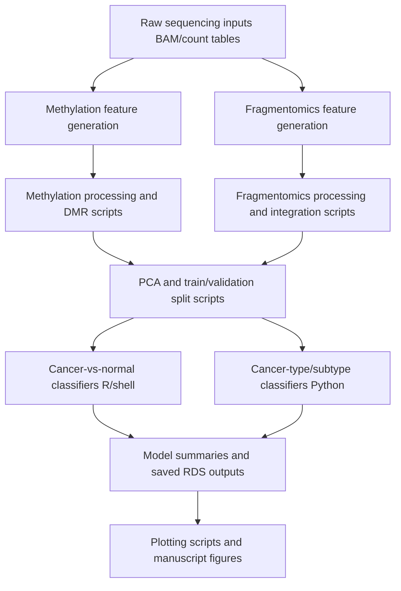

# Pipeline Overview

## Scope
This repository contains three coupled analysis layers:
1. Methylation feature generation and differential methylation analysis.
2. Fragmentomics feature generation and integration.
3. Machine-learning model training, validation, and plotting.

## End-To-End Flow

## Recommended Execution Order
1. Run methylation shell generation script.
2. Run methylation processing scripts in numeric order.
3. Run fragmentomics shell generation script(s) matching cohort.
4. Run fragmentomics processing scripts in numeric order.
5. Run PE/SE PCA preparation scripts (`6.2A`, `6.2B`).
6. Run cancer-vs-normal runners (`Run_CN_classifier*.sh`).
7. Run cancer-origin and subtype Python scripts using run tables.
8. Run plotting scripts to aggregate results.

## Entrypoints
- Methylation generation: `1_Methylation_Scripts/Shell_scripts_to_generate_features/1_sbatch_methylation_analysis.sh`
- Fragmentomics generation: `2_Fragmentomics_Scripts/Shell_scripts_to_generate_features_from_bams/1_Runner_scripts/*.sh`
- PE/SE PCA prep: `3_Machine_Learning_Scripts/1_Select_and_PCA_transform_features/*.R`
- CN classifiers: `3_Machine_Learning_Scripts/2_Shell_and_R_scripts_for_running_ML_pipelines_PE_data_cancer_vs_normal_classifier/1_Runner_scripts/*.sh`
- Cancer/subtype classifiers: `3_Machine_Learning_Scripts/3_Scripts_for_running_ML_pipelines_PE_data_cancer_type_or_subtype/*.py`
- Plotting: `3_Machine_Learning_Scripts/4_Machine_learning_plotting_scripts/*.R`

## Runtime Assumptions
- HPC scheduling environment is available for shell runners.
- Large input matrices are prepared externally (see manuscript supplementary data mapping).
- Scripts may require path edits or environment-variable overrides before first run.
